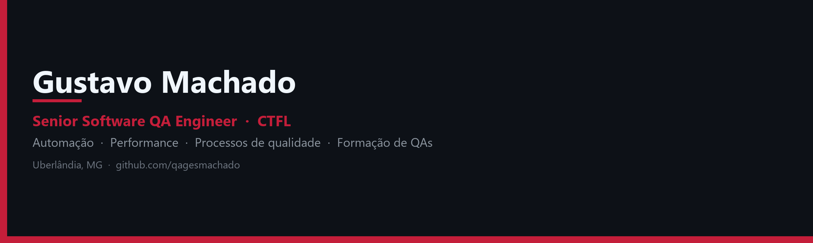

  

# Gustavo Machado

**Senior Software QA Engineer**, certificado **CTFL** e educador.

Atuo com qualidade de software **desde 2018** (quase 9 anos): estratégia de testes, automação, performance, pipelines e construção de processos. Também ensino QA no YouTube, na Udemy e em mentorias.

---

## Onde me encontrar

---

## Sobre mim

Sou Software QA Engineer desde **2018** — quase **9 anos** de atuação em projetos nacionais e internacionais, cobrindo **web, API, mobile, desktop e telecomunicações**.

Minha atuação combina execução (manuais e automatizados) com construção de processo: requisitos, cultura de qualidade, evidências e integração dos testes no CI/CD.

Formação: Engenharia Eletrônica e de Telecomunicações (UFU), com pós-graduação em QA e Teste de Software e em Inteligência Artificial e Machine Learning.

---

## Áreas de atuação

- Engenharia de qualidade de software
- Automação de testes (web, API e mobile)
- Testes de performance
- Estratégia de testes e qualidade contínua
- CI/CD e integração de testes em pipelines
- Processos, métricas e cultura de qualidade
- Educação, cursos e mentoria de QAs

---

## Tecnologias em destaque

### Linguagens

### Testes e automação

### Performance

### DevOps, API e qualidade

---

## Certificação

**Certified Tester Foundation Level (CTFL)** — [certificado digital](https://skillshub.isqi.org/7a620243-afc4-4d95-a677-8babaf8cf227)

---

## Organização: Gustavo Machado QA — Cursos e Mentorias

Fundador e administrador de [**qagesmachado-cursos**](https://github.com/qagesmachado-cursos).

A organização concentra o material de ensino: repositórios dos cursos, projetos das aulas ao vivo e o código das playlists do YouTube. O foco é formar QAs com conteúdo aplicável — da base teórica à automação e ao CI/CD.

O que você encontra lá:

- Cursos online (Udemy): Robot Framework, Postman, Git/GitHub, GitHub Actions, CTFL e introdução à área de testes
- Turmas ao vivo: preparatório CTFL 4.0, testes de API com Postman e automação com Cypress
- Playlists gratuitas no YouTube, com repositórios de apoio
- Mentoria para capacitação de QA Engineer (em breve)

---

## Palestras

- [4AllTest 2024](https://youtu.be/I3pbZbObpQY)
- [QA Solidário — 2ª edição](https://www.youtube.com/live/cQb2w2tu2Es)
- [QA Culture Vincit 2024](https://www.youtube.com/live/4C8-4op5GI0)

---

## Estatísticas

  
  

---

## O que você encontra neste GitHub

- Exemplos de automação e templates
- Materiais de apoio para aulas, cursos e o canal
- Experimentos com ferramentas de qualidade

Foco em qualidade aplicável ao mercado, com visão de engenharia.
